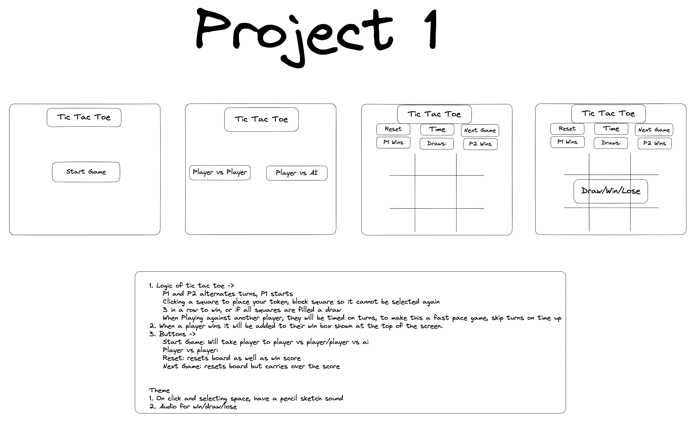

# Tic Tac Toe

## Table of Contents

- [Description](#description)
- [Getting Started](#getting-started)
- [Brief and Timeframe](#brief-and-timeframe)
- [Planning](#planning)
- [Build](#build)
- [Challenges](#challenges)
- [Wins](#wins)
- [Bugs](#bugs)
- [Future Improvements](#future-improvements)
- [Key Learnings](#key-learnings)

## Description

This project is a tic tac toe game. The aim was to allow 2 game modes of player vs player and player vs computer. The win condition will be the same as standard tic tac toe rules of 3 in a row, and if all space are used up, without a 3 in a row, then the game will end in a draw.

## Getting Started

You can play my game [Here](AzurePho.github.io)

Once the page has loaded, you are given two buttons, 1 for 2 players and one to play against AI. Upon clicking on one, the game will start.

## Brief and Timeframe

Building a functional browser game, using solely JavaScript. This was a solo project and was giving a week to complete.

- The game should be playable for two players on the same computer, taking turns to make their moves
- The winner should be displayed when the game is over
- Single player mode with the computer attempting reasonable moves

## Planning



The above wireframe shows the planning and how I expect my game to look like, this also includes the the logic that logic flow of how the game. The wireframe shows how I envisioned my game to look.

## Build

- I initially wanted to create the board using a JavaScript function, but opted to use HTML and CSS instead. I have created the main div with the board class and id, this sets there to be 9 divs which represents each square within the board, I have then used the data attribute to number each of the cells which will be used for the winning condition. The CSS is what builds and makes it look like a grid, specifically the board class. The cell class is what makes it outlines each cell and makes it so when hovering a cell, the cursor changes to show it is clickable.

```HTML
<h1>Tic Tac Toe</h1>
    <div class="buttons">
      <button id="pvp">2 Players</button>
      <button id="vsai">Vs AI</button>
    </div>
    <div class="board" id="board">
      <div class="cell" data-index="1"></div>
      <div class="cell" data-index="2"></div>
      <div class="cell" data-index="3"></div>
      <div class="cell" data-index="4"></div>
      <div class="cell" data-index="5"></div>
      <div class="cell" data-index="6"></div>
      <div class="cell" data-index="7"></div>
      <div class="cell" data-index="8"></div>
      <div class="cell" data-index="9"></div>
    </div>
    <h2 id="status"></h2>
```

```CSS
.board {
  display: grid;
  margin: auto;
  grid-template-columns: 200px 200px 200px;
  grid-template-rows: 200px 200px 200px;
  height: 600px;
  width: 600px;
}
.cell {
  display: flex;
  align-items: center;
  justify-content: center;
  height: 200px;
  width: 200px;
  border: 1px solid black;
  font-size: 100px;
  cursor: pointer;
}
```

- The first thing that I did when starting the JavaScript side, was adding variables that I will be using, this wasn't initially created all at once, where I added each variable when I needed them.

```js
const playerX = "x";
const playerO = "o";
let turn = playerX;
let winner = "";
let compMadeMove = false;

const boardState = ["", "", "", "", "", "", "", "", ""];
const gameStatus = document.getElementById("status");
const cells = document.querySelectorAll("[data-index]");
const vsPlayer = document.getElementById("pvp");
const vsComp = document.getElementById("vsai");
let gameState = false;

const winCombos = [
  [0, 1, 2],
  [3, 4, 5],
  [6, 7, 8],
  [0, 3, 6],
  [1, 4, 7],
  [2, 5, 8],
  [0, 4, 8],
  [2, 4, 6],
];
```

- Once I had my variables, the first function I created was the placeMarker, this is cause I needed to first test that I was able to place them when clicking each cell.

```js
function placeMarker(e) {
  if (!gameState) {
    return;
  }

  const cell = e.target;

  if (cell.innerText != "") {
    return;
  }
  const cellNumber = cell.dataset.index;

  if (turn === playerX) {
    cell.innerText = playerX;
    boardState[cellNumber - 1] = playerX;
  } else {
    cell.innerText = playerO;
    boardState[cellNumber - 1] = playerO;
  }

  checkWin();
  hoverMarker();
}
```

- I then needed to make a function that will check for win conditions, once I was able to place markers.

```js
function checkWin() {
  let roundWon = false;
  for (let i = 0; i <= 7; i++) {
    const winCondition = winCombos[i];
    let a = boardState[winCondition[0]];
    let b = boardState[winCondition[1]];
    let c = boardState[winCondition[2]];
    if (a === "" || b === "" || c === "") {
      continue;
    }
    if (a === b && b === c) {
      roundWon = true;
      gameState = false;
      winner = a;
      break;
    }
  }
  if (roundWon) {
    gameStatus.innerText = `${winner} is the winner!`;
    console.log(`winner is ${winner}`);
    hoverMarker();
  }

  if (!roundWon && !boardState.includes("")) {
    gameStatus.innerText = "It's a tie!";
    gameState = false;
    hoverMarker();
  }
  if (!gameState) return;
  turnChange();
  gameStatus.innerText = `It's ${turn}'s turn`;
}
```

- Once the checkWin was completed, I then focused on the the turn change, this was 1 line of code using a ternary operator

```js
function turnChange() {
  turn = turn === playerX ? playerO : playerX;
}
```

- With these the 2 players function works fine, and I then add an extra step to show a hover marker to show players an indiaction of where the marker will be placed.

```js
function hoverMarker() {
  cells.forEach((cell) => {
    cell.classList.remove("x-hover");
    cell.classList.remove("o-hover");
  });
  if (!gameState) {
    return;
  }

  const hoverClass = `${turn}-hover`;

  cells.forEach((cell) => {
    if (cell.innerText == "") {
      cell.classList.add(hoverClass);
    }
  });
}
```

- I then started on the player vs ai side of the game, where i created two seperate functions, one for solely the user placing a marker and one for the computer to place a marker.
- When creating where the computer can place markers, it took more thought that expected, I did this by creating a new array of empty cells, then using math.random to pick one of the cells to place it in.
- I used the same checkWin function that I used previously as it is exactly doing the same thing.

```js
function userMove(e) {
  if (!gameState) {
    return;
  }
  const cell = e.target;
  if (cell.innerText !== "") {
    return;
  }
  cell.innerText = playerX;
  let cellIndex = cell.dataset.index;
  boardState[cellIndex - 1] = playerX;
  checkWin();
  if (!gameState) return;
  compTurn();
  hoverMarker();
}
```

```js
function compRandomMove() {
  let emptyCells = [];
  for (let i = 0; i < boardState.length; i++) {
    if (boardState[i] === "") {
      emptyCells.push(i);
    }
  }
  let randomIndex = emptyCells[Math.floor(Math.random() * emptyCells.length)];
  let selectedCell = cells[randomIndex];
  selectedCell.innerText = playerO;
  boardState[randomIndex] = playerO;
  checkWin();
}
```

- I then created the computer to attemp to win if they have 2 markers in a row, this will check to see if the computer has a win condition to win which is 2 markers within the same line, if they do they will always place it in the empty cell to win, this also blocks the player from winning if they have the same, except if the player has a two way win. If both conditions are not met, it will use the function from earlier which places the marker in a random empty cell.

```js
function compTurn() {
  if (!gameState || !vsComputer) {
    return;
  }
  for (let i = 0; i <= 7; i++) {
    const winCondition = winCombos[i];
    let a = boardState[winCondition[0]];
    let b = boardState[winCondition[1]];
    let c = boardState[winCondition[2]];
    if (a === turn && b === turn && c === "") {
      c = turn;
      boardState[winCondition[2]] = turn;
      cells[winCondition[2]].innerText = turn;
      checkWin();
      computerMadeMove = true;
      return;
    }
    if (a === turn && b === "" && c === turn) {
      b = turn;
      boardState[winCondition[1]] = turn;
      cells[winCondition[1]].innerText = turn;
      checkWin();
      computerMadeMove = true;
      return;
    }
    if (a === "" && b === turn && c === turn) {
      a = turn;
      boardState[winCondition[0]] = turn;
      cells[winCondition[0]].innerText = turn;
      checkWin();
      computerMadeMove = true;
      return;
    }
  }
  for (let i = 0; i <= 7; i++) {
    const winCondition = winCombos[i];
    let a = boardState[winCondition[0]];
    let b = boardState[winCondition[1]];
    let c = boardState[winCondition[2]];
    if (a === playerX && b === playerX && c === "") {
      c = turn;
      boardState[winCondition[2]] = turn;
      cells[winCondition[2]].innerText = turn;
      checkWin();
      computerMadeMove = true;
      return;
    }
    if (a === playerX && b === "" && c === playerX) {
      b = turn;
      boardState[winCondition[1]] = turn;
      cells[winCondition[1]].innerText = turn;
      checkWin();
      computerMadeMove = true;
      return;
    }
    if (a === "" && b === playerX && c === playerX) {
      a = turn;
      boardState[winCondition[0]] = turn;
      cells[winCondition[0]].innerText = turn;
      checkWin();
      computerMadeMove = true;
      return;
    }
  }

  if (compMadeMove) return;
  compRandomMove();
  hoverMarker();
}
```

- The last part was to set it so the buttons are used to select if the player wishes to play against another player or against an ai and reorganised to set the buttons to start the game as shown below

```js
vsPlayer.addEventListener("click", twoPlayers);

vsComp.addEventListener("click", vsComputer);
```

```js
function twoPlayers() {
  boardClear();
  gameState = false;
  gameState = true;
  turn = playerX;
  hoverMarker();
  cells.forEach((cell) => cell.addEventListener("click", placeMarker));
  hoverMarker();
  gameStatus.innerText = `It's ${turn}'s turn`;
}
```

```js
function vsComputer() {
  boardClear();
  gameState = false;
  gameState = true;
  turn = playerX;
  cells.forEach((cell) => cell.addEventListener("click", userMove));
  gameStatus.innerText = `It's ${turn}'s turn`;
  hoverMarker();
}
```

# Challenges

- I found that the challenges I had was mostly to do with the hovering of the markers, as they werent always showing correctly, to rectify them I placed extra hovermaker functions within my code, but this makes it so the code is repeated multiple times and doesnt look as nice when reading through.
- I had also spent a lot of time trying to clean my code up and tried as much as I can to seperate functions for them to be used in multiple places, such as the checkWin, when trying to clean up my code, it would break elsewhere and I kept having to go back and forth between fixing and cleaning.

# Wins

- I would say the biggest win I have is that I'm almost certain there are no bugs within my game, and that it works as intended.
- Also the logic of the computer win conditioning and attempting to block the player from winning, is my strongest part of my code.

# Bugs

There were no bugs in my game upon completion. It ended up working as intended in the end.

# Future Improvements

- Initially I had wanted to keep track of the score between p1/2 as well as the amount of times a draw has occured. This would be a future improvement that I would include if I'm to work on this again or starting from scratch.
- When selecting playing against a computer I could give different difficulties, which range from easy, intermediate, advanced. An example would be for easy it would always place markers in a random spot regardless of if they are to win next turn or player is, intermediate would be the current game, and advanced would always make it so the player cannot win.
- One thing I'm terrible at is designing as I have no creativity, and adding CSS to make my game look more presentable would be a major improvement.

# Key Learnings

- I feel a lot more comfortable with seperating functions and then calling them within other functions to make the code look cleaner.
- I feel more comfortable with the logical flow of how coding should work. for example having boardClear at the start of twoPlayers() and vsComputer()
